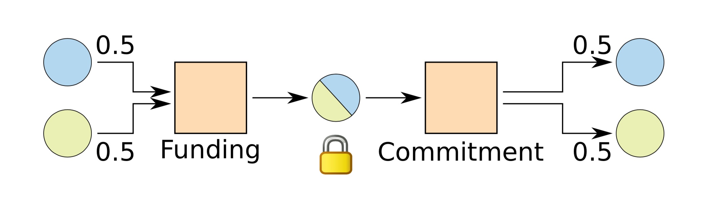

## Summary of different payment channel proposals

### Common mechanics in design

#### _Output chaining._
When you 'spend' in Bitcoin you are giving someone else the right to move coins and you can place conditions on that future move. A common method in chaining is to output to a multi-sig p2sh that contains one of your keys.

 _Image Source: Scalable Funding of Bitcoin Micropayment Channel Networks by Burchert, Decker, and Wattenhofer_

#### _Limiting transaction publish._
Transaction publish is limited through the use of nLockTime to ensure that a redeem or commit transaction can only be added to a block after the desired wait time. This method is used to delay revocation spends, redeem scripts as well as settlement (channel close) transactions.
#### _Limiting output spends._
CheckLockTimeVerify (CLTV) is used to enforce output spends at a certain absolute height or time. CheckSequenceVerify (CSV) is used to encumber an output and prevent it from being spent during a relative period (revocation or challenge period). While used for different cases the idea is the same.
A waiting period is created using CLTV or CSV in order to allow for many spends in a channel or for a challenge period.
#### _Revocation keys & preimages._
The idea is to allow for a conditional payment where the bearer of the secret can claim funds immediately. The sender of funds creates the preimage and discloses it to the receiver only when a next channel state is negotiated. This shuns the broadcasting of a previous state. One-off private keys or hash preimages are used to allow for revocation. Duplex, Poon-Dryja and HLTC-based channels all employ this mechanism. Used in conjunction with timeout period.

 _Image Source: Scalable Funding of Bitcoin Micropayment Channel Networks by Burchert, Decker, and Wattenhofer_

###### Simple Revoke from Alice to Bob
```
HASH160 <revokehash> EQUAL
IF
    <Bob's pubkey>
ELSE
    "24h" CHECKSEQUENCEVERIFY DROP
    <Alice's pubkey>
ENDIF
CHECKSIG
```
#### _Symmetrical transaction creation._


#### Useful links

[Payment channels - Bitcoin Wiki](https://en.bitcoin.it/wiki/Payment_channels)

[Lightning Dev Resources](http://dev.lightning.community/resources/index.html)

[Channel malleability - SO](https://bitcoin.stackexchange.com/questions/48243/are-micropayment-channels-still-subject-to-malleability-after-bip65#48546)

[BIP-65 CLTV](https://github.com/bitcoin/bips/blob/master/bip-0065.mediawiki)

[BIP-68 Relative lock time](https://github.com/bitcoin/bips/blob/master/bip-0068.mediawiki)

Channels on Bitcoin Magazine for diagrams [one](https://bitcoinmagazine.com/articles/understanding-the-lightning-network-part-building-a-bidirectional-payment-channel-1464710791/) [two](https://bitcoinmagazine.com/articles/understanding-the-lightning-network-part-creating-the-network-1465326903/) [three](https://bitcoinmagazine.com/articles/understanding-the-lightning-network-part-completing-the-puzzle-and-closing-the-channel-1466178980/)

[Deployable Lightning](https://github.com/ElementsProject/lightning/blob/master/doc/deployable-lightning.pdf)

[Duplex channels by Decker - YT](https://www.youtube.com/watch?v=s-De7N3ctI4)

_This repo uses markdown with embedded mermaid that isn't fully support on Github_

A few options for rendering:

* Atom + Markdown Preview Enhanced
* [Mermaid live editor](https://mermaidjs.github.io/mermaid-live-editor/)
