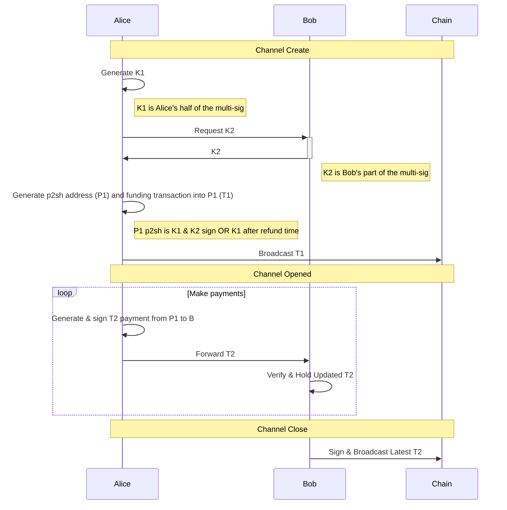

##### CheckLockTimeVerify channel

* Unidirectional from Alice to Bob
* Required CLTV (BIP-65)
* Sidesteps malleability using p2sh address
* Requires negotiation of refund timeout



##### A1 p2sh formats

\#1
```
IF
    2 <Alice's pubkey> <Bob's pubkey> 2 CHECKMULTISIG
ELSE
    <now + refund timeout> CHECKLOCKTIMEVERIFY DROP
    <Alice's pubkey> CHECKSIG
ENDIF

OP_IF
    OP_2
    '[029bb30cc09bfbd126c7ca3f18e9f4d8ee0da727254490546b7278aab3fd76cfdf]' '[03e7e7c9ecbd81dfadb96c6f6e442b42e4492dc998e19e626fafd278eb65647aab]'
    OP_2
    CHECKMULTISIG
OP_ELSE
    144
    CHECKLOCKTIMEVERIFY
    DROP
    '[029bb30cc09bfbd126c7ca3f18e9f4d8ee0da727254490546b7278aab3fd76cfdf]'
    CHECKSIG
OP_ENDIF
```
