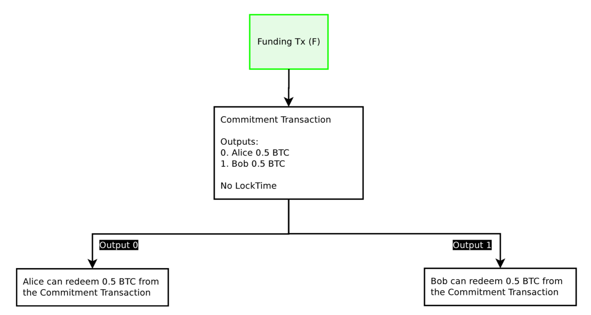
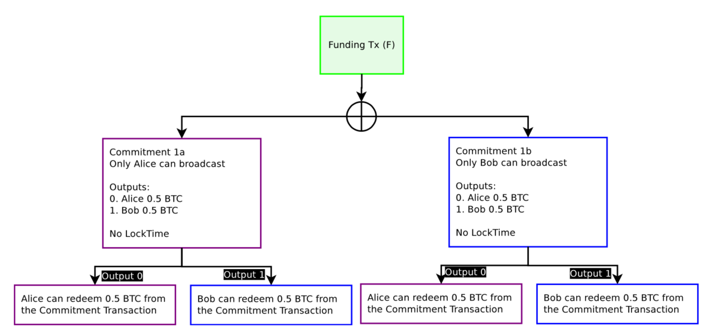

##### Poon-Dryja (Lightning) channels


_This contains the current form of transactions and NOT the original paper._


* Payer sends signed first
* Requires timeout negotiation

###### Funding transaction

Will be signed by Alice and Bob
```
2 <pubkey1> <pubkey2> 2 OP_CHECKMULTISIG
```
###### Commitment transaction Alice output

Will be signed by Alice and Bob
```
OP_IF
    <revocation pubkey>
OP_ELSE
    <timeout>
    OP_CSV
    OP_DROP
    <alice's pubkey>
OP_ENDIF
OP_CHECKSIG
```

 _Image Source: The Bitcoin Lightning Network: Scalable Off-Chain Instant Payments by Poon and Dryja_

##### Symmetrical transaction creation

* For blame; claim all funds

 _Image Source: The Bitcoin Lightning Network: Scalable Off-Chain Instant Payments by Poon and Dryja_


##### Sample Full HTLC (Alice to Bob)

```
# Courtesy of the Lightning RFC
# To remote node with revocation key
OP_DUP OP_HASH160 <RIPEMD160(SHA256(revocationpubkey))> OP_EQUAL
OP_IF
    OP_CHECKSIG
OP_ELSE
    <Bob htlcpubkey> OP_SWAP OP_SIZE 32 OP_EQUAL
    OP_NOTIF
        # To local node via HTLC-timeout transaction (timelocked).
        OP_DROP 2 OP_SWAP <Alice htlcpubkey> 2 OP_CHECKMULTISIG
    OP_ELSE
        # To remote node with preimage aka R
        OP_HASH160 <RIPEMD160(payment_hash)> OP_EQUALVERIFY
        OP_CHECKSIG
    OP_ENDIF
OP_ENDIF
```
