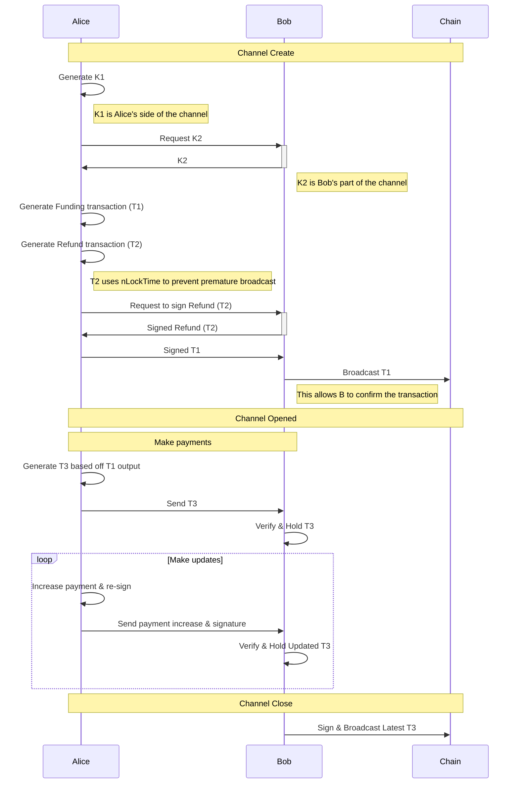

Spilman payment channels [original source](https://lists.linuxfoundation.org/pipermail/bitcoin-dev/2013-April/002433.html)

* Unidirectional from Alice to Bob
* Expects to use nSequence
* Affected by malleability

